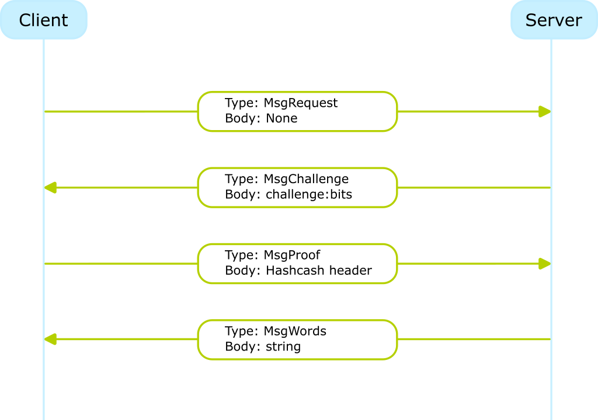

# PoW-WoW
Tcp server and client for words of wisdom with protection from DDOS using PoW

## How it works
When client makes a tcp connection to the server and requests for words of wisdom, at first the server responds with the challenge that client needs to solve using proof of work (PoW) computation. Both client and server use simplified hashcash version implemented in [`lib/hashcash`](lib/hashcash/hashcash.go).

This implementation let's dynamically adjust the required zero bit count for PoW thus letting the server to balance the load.

## TCP protocol
Messages that are being sent between client and server are made up of tree parts:
* MessageType - represented as a first byte, currently five types are defined;
* Body - contents of the message;
* EndByte - byte representation of `\n` character, indicates the end of a message.

## Communication flow


## How to run
There are two seperate dockerfiles for client and server.

### docker run
```bash
docker build -t pclient -f ./cmd/client/Dockerfile .
docker build -t pserver -f ./cmd/server/Dockerfile .
docker run -d --net host pserver
docker run --net host pclient
```

### docker-compose
```bash
docker-compose up
```
